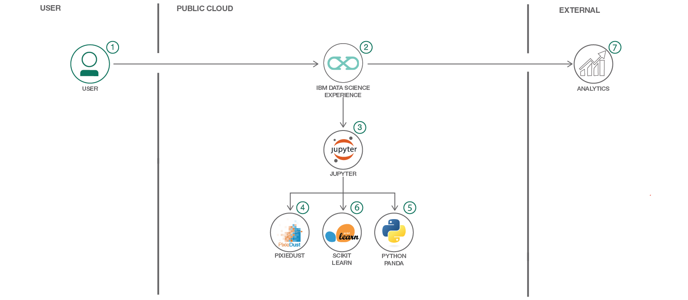
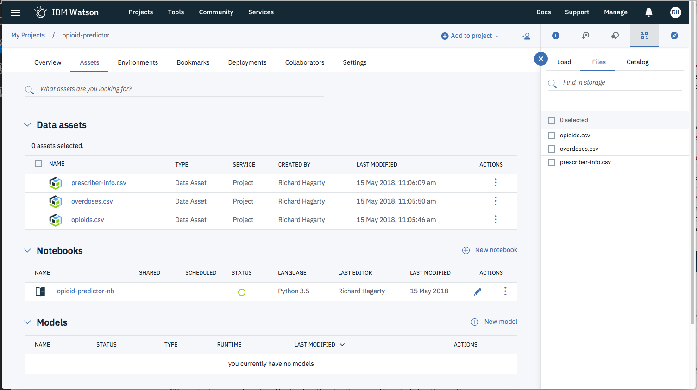
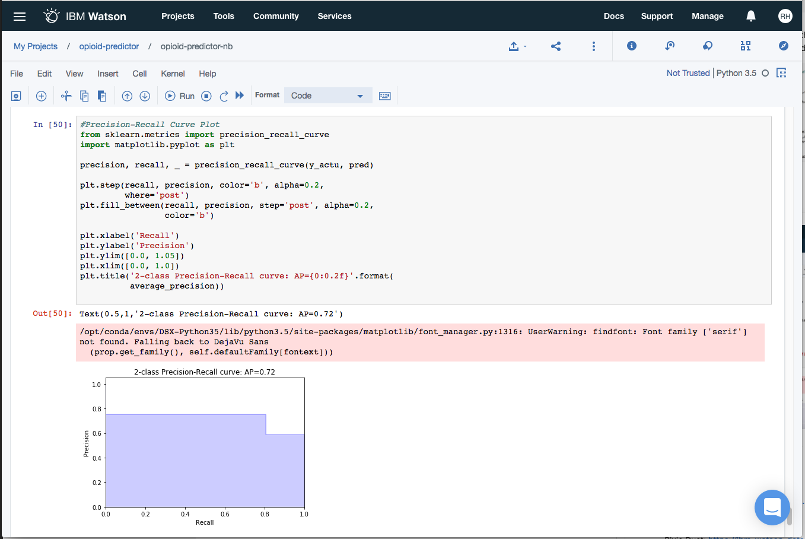

*他の言語で読む: [English](README.md).*

## Watson Studio と scikit-learn による機械学習を利用して、米国のオピオイド処方医師について予測する

> Data Science Experience は 現在 Watson Studio です。このコードパターンの一部の画像では、サービスが Data Science Experience として表示されることがありますが、手順とプロセスは引き続き機能します。

このコードパターンは、Watson Studioで `scikit-learn` と `python` をどのように使用して [2014年の kaggle データセット](https://www.kaggle.com/apryor6/us-opiate-prescriptions/data) からオピオイド処方を予測するかに焦点を合わせています。

米国では、[オピオイド](https://ja.wikipedia.org/wiki/%E3%82%AA%E3%83%94%E3%82%AA%E3%82%A4%E3%83%89) の過剰摂取が非常に深刻な問題になってきています。
データ・サイエンティストが独力でこの問題を解決できるわけではありませんが、データを調べて、この問題の現状と特定の結果を招いている要因を特定することはできます。

このコードパターンは、オピオイドによる死亡数を州ごとに、医師とその資格と専門分野ごとに、2014年にオピオイドを処方したか否かにかかわらず、処方された処方箋の具体的な名称などで kaggle データセットを調査することを目的とします。
これから Watson Studio ノートブックでデータを調べる方法を知り、最初に発見した幾つかの事実を、Pixie Dust を使用して地理情報も含めて様々な方法で視覚化します。
Pixie Dust は、データを視覚的に非常に迅速に探求することに適したライブラリです。
文字通り、1行のコードしか必要としません！
最初の探索が完了すると、このコードパターンは機械学習ライブラリ scikit-learn を使用していくつかのモデルを訓練し、オピオイド処方の最も正確な予測を有するものを特定します。
良く知らない方に説明すると、Scikit は、データ科学者が一般に使用する、容易に使用できる機械学習ライブラリです。
具体的には、ライブラリを使用することで、多数の機械学習分類子を比較的少ないコード行で実装でき、それに簡単にアクセスできます。
さらに、scikit-learn を使用すると、結果を視覚化して結果を表示することができます。
このため、このライブラリは機械学習のクラスでよく使用されていますが、まさにこのコードパターンが強調する、比較出力のようなさまざまな分類子を教えるために使用されます。

さて、準備はいいですか？



## Flow

1. IBM Watson Studio サービスにログインします。
2. Watson Studio 内でデータをデータ・アセットとしてアップロードします。
3. Watson Studio 内でノートブックを起動し、作成したデータ・アセットを入力します。
4. pandas を使用してデータを探索します。
5. Pixie Dust を使用してデータ視覚化を作成します。
6. scikit-learn を使用して機械学習モデルをトレーニングします。
7. 各モデルの予測パフォーマンスを評価します。

## 含まれるコンポーネント

* [IBM Watson Studio](https://www.ibm.com/blogs/solutions/jp-ja/watson-studio/): RStudio、Jupyter、Python を使用でき、管理された Spark などの付加価値を含む、データを分析のために構成された共同作業環境。
* [Jupyter ノートブック](http://jupyter.org/): ライブコード、方程式、視覚化、説明テキストを含むドキュメントを作成して共有できるオープンソースの Web アプリケーション。
* [PixieDust](https://github.com/ibm-cds-labs/pixiedust): Python ノートブックのための Python ヘルパーライブラリ。

## 利用した技術

* [Data Science](https://medium.com/ibm-data-science-experience/): 知識と洞察を抽出するために、構造化データと非構造化データを分析するシステムと科学的方法。
* [Python](https://www.python.org/): Python は、より迅速に作業し、システムをより効果的に統合するためのプログラミング言語です。
* [pandas](http://pandas.pydata.org/): 高性能で使いやすいデータ構造を提供する Python ライブラリ。

# 手順

このコードパターンは、2つのアクティビティで構成されています:

* [IBM Watson Studio で Jupyter ノートブックを使用する](#run-using-a-jupyter-notebook-in-the-ibm-watson-studio).
* [データの分析と予測](#analyze-and-predict-the-data).

<a name="run-using-a-jupyter-notebook-in-the-ibm-watson-studio"></a>
## IBM Watson Studio で Jupyter ノートブックを使用する

1. [Watson Studio に登録する](#1-sign-up-for-the-watson-studio)
2. [Watson Studio プロジェクトの新規作成](#2-create-a-new-watson-studio-project)
3. [ノートブックの作成](#3-create-the-notebook)
4. [データのアップロード](#4-upload-data)
5. [ノートブックを実行する](#5-run-the-notebook)
6. [保存し共有する](#6-save-and-share)

<a name="1-sign-up-for-the-watson-studio"></a>
### 1. Watson Studio に登録する

IBM [Watson Studio](https://dataplatform.ibm.com) にログインまたは登録する。

> ノート: 残りの Watson Studio セットアップ手順をスキップし、完了したノートブックを表示するだけの場合は、次のようにします:
>* 完了した [ノートブック](https://dataplatform.ibm.com/analytics/notebooks/c32975c1-3994-42cc-8e2d-3f579ceebf63/view?access_token=cdb14a077ed4746b09b1dbaa05aee70133589f001dbb7582ba4e7fcfdd73a905) とその出力をそのまま表示します。
>* ノートブックを見ている間、それをダウンロードして、将来の使用のために保管することもできます。
>* 完了したら、[データの分析と予測](#analyze-and-predict-the-data) セクションにジャンプして、このコードパターンを続行します。

<a name="2-create-a-new-watson-studio-project"></a>
### 2. Watson Studio プロジェクトの新規作成

* Watson Studio のランディングページから `New Project` オプションを選択し、`Data Science` オプションを選択します。

  

* Watson Studio でプロジェクトを作成するには、プロジェクトに名前を付けて、新しい `Cloud Object Storage` サービスを作成するか、IBM Cloud アカウントから既存のものを選択します。

  

* プロジェクトの作成が成功すると、プロジェクトのダッシュボードビューに移動します。`Assets` と `Settings` タブをメモし、私たちのプロジェクトを外部の資産 (データセットとノートブック) や他の IBM クラウドサービスと関連付けるために使用します。

  

<a name="3-create-the-notebook"></a>
### 3. ノートブックの作成

* プロジェクトダッシュボードビューから、`Assets` タブをクリックし、`+ New notebook` ボタンをクリックします。

  

* ノートブックに名前をつけ、希望のランタイムを選択します。今回の場合、関連する Spark ランタイムを使用します。

  

* `From URL` タブを選択して、このリポジトリ内のノートブックへの URL を指定します。

  

* 以下の URL を入力します:

  ```
https://github.com/IBM/predict-opioid-prescribers/blob/master/notebooks/opioid-prescription-prediction.ipynb
```

* `Create` ボタンをクリックします。

<a name="4-upload-data"></a>
### 4. データのアップロード

* プロジェクトのダッシュボードビューに戻り、`Assets` タブを選択します。
* このプロジェクトには3つのデータセットがあります。プロジェクト内の3つすべてをデータ資産としてアップロードします。これを行うには、各データセットを右側のポップアップセクションにロードします。下記のスクリーンショットを参照してください。
* 完了したら、編集モードでノートブックに移動します (ダッシュボード上のノートブックの横にある鉛筆アイコンをクリック)。
* 右上の ``1001`` データアイコンをクリックしてください。データファイルが表示されます。
* それぞれをクリックし、``Insert Pandas Data Frame`` を選択します。いったんこれを実施すると、最初のセルに一連のコードが表示されます。
* ``opioids.csv`` が ``df_data_1`` として保存され、``overdoses.csv`` が ``df_data_2`` として保存され、``prescriber_info.csv`` が ``df_data_3`` として保存されます。それは元のノートブックと同様です。
データをノートブックにロードするとき、データフレームの中止地点からの継続として定義することができます。
これは、あなたのデータ ``opioids.csv`` が `` df_data_4``、``overdoses.csv`` が ``df_data_5`` などと表示されることを意味します。
データフレーム名を今回の例と同じになるように調整するか (データをロードした場所を削除し、データフレームの名前を変更するか、読み込み情報を元のコードに入力する)、もしくはその名に応じて以下のコードを編集します。
これはコードを実行するために重要です！

  

<a name="5-run-the-notebook"></a>
### 5. ノートブックを実行する

ノートブックが実行される際、実際の動作としては、ノートブック内の各コード・セルが上から順に実行されています。

各コード・セルは選択可能で、左端にタグが付いています。タグのフォーマットは `In [x]：` です。ノートブックの状態に応じて、 `x` は次のようになります:

* 空白は、セルが実行されたことがないことを示します。
* 数字は、このコードステップが実行された相対的な順序を表します。
* `*` は、セルが現在実行中であることを示します。

ノートブックでコードセルを実行する方法はいくつかあります:

* 一度に1つのセルを実行
  * セルを選択し、ツールバーの `Play` ボタンを押します。
* 順番に実行するバッチモード
  * `Cell` メニューバーにはいくつかのオプションがあります。例えば、 `Run All` でノートブックの全てのセルを実行することができます。`Run All Below` では、現在選択されているセルのうち最初のセルから実行を開始し、それに続くすべてのセルを実行します。
* 予定時刻に実行する
  * ノートブックパネルの右上にある `Schedule` ボタンを押してください。 ここでは、ノートブックが将来のある時点で1回実行されるように、または指定された間隔で繰り返し実行されるように、スケジュールすることができます。

<a name="6-save-and-share"></a>
### 6. 保存し共有する

#### 保存の方法

`File` メニューの下に、ノートブックを保存する方法がいくつかあります:

* `Save` はバージョン情報なしで、単にノートブックの現在の状態を保存するだけです。
* `Save Version` はノートブックの現在の状態を日付とタイムスタンプを含むバージョンタグで保存します。ノートブックは最大10バージョンを保存することができ、それぞれのバージョンは、`Revert To Version` メニュー項目を選択することで取得できます。

#### 共有の方法

ノートブックパネルの右上にある `Share` ボタンを選択すると、ノートブックを共有できます。このアクションを実行することで、ノートブックの「読み取り専用」バージョンを表示するURLリンクが得られます。 ノートブックから共有したいものを明確に指定するオプションがいくつかあります:

* `Only text and output`: すべてのコードセルをノートブックビューから削除します。
* `All content excluding sensitive code cells`: *sensitive* (機密) タグを含むコードセルをすべて削除します。例えば、`# @hidden_cell` はあなたの dashDB 資格情報が共有されるのを防ぐために使われます。
* `All content, including code`: ノートブックをそのまま表示します。
* これら以外にも、様々な `download as` オプションがメニューにあります。

<a name="analyze-and-predict-the-data"></a>
## データの分析と予測

1. Python、pandas、Pixie Dust を使用して様々なデータセットを調べてください。また、気軽に [Watson Studio でフォロー](https://dataplatform.ibm.com/analytics/notebooks/c32975c1-3994-42cc-8e2d-3f579ceebf63/view?access_token=cdb14a077ed4746b09b1dbaa05aee70133589f001dbb7582ba4e7fcfdd73a905) してください。

  データに慣れ親しむには、視覚化やデータのサブセットを調べることでデータを探求してください。たとえば、カリフォルニア州で最も多い摂取量が見られますが、人口で修正すると、実際にはウェストバージニア州で一人当たりの過剰摂取率が最も高いことがわかります。

2. Pythonを使用してデータを整理します。

  すべてのデータセットには不完全さがあります。状態を一貫させ、カラムを変更して整数として使用できるようにすることで、私たちのデータを整理 (クリーンアップ) しましょう。

3. いくつかのモデルを実行し、scikit-learn を使用してオピオイド処方を予測します。

  ノートブック、または下の画像で出力を確認することができます。
このステップでは、オピオイド処方の予測に最も効果的なものを評価するために、いくつかの機械学習モデルを実行します。
このパターンの範囲を超えていますが、これらのオピオイド処方を予測することによって、特定のタイプの医師がオピオイドを処方する可能性を予測するフレームワークが構築されようとしています。
さらに、2014年以降のデータが長年にわたっている場合、将来の過剰摂取量を予測することもできるかもしれません。
今はまず、モデルを見てみましょう。

4. モデルを評価します。

  コードについては、ローカル [notebooks](notebooks) にあるノートブックを参照するか、[こちら](https://dataplatform.ibm.com/analytics/notebooks/c32975c1-3994-42cc-8e2d-3f579ceebf63/view?access_token=cdb14a077ed4746b09b1dbaa05aee70133589f001dbb7582ba4e7fcfdd73a905) のノートブックを参照してください！

## サンプル出力

さまざまな分類子を実行した後、Random Forest、Gradient Boosting、および我々の Ensemble models がオピオイド処方を予測する上で最高のパフォーマンスを持つことがわかりました。




すばらしい仕事はまだ続きます！
もう一度試してみるか、別のユースケースに適用してみてください！

## リンク

 - Watson Studio: https://datascience.ibm.com/docs/content/analyze-data/creating-notebooks.html
 - Pandas: http://pandas.pydata.org/
 - Pixie Dust: https://ibm-watson-data-lab.github.io/pixiedust/displayapi.html#introduction
 - Data: https://www.kaggle.com/apryor6/us-opiate-prescriptions/data
 - Scikit Learn: http://scikit-learn.org/stable/

# もっと詳しく知る

* **Data Analytics コードパターン**: このコードパターンを気に入りましたか？ [Data Analytics コードパターン](https://developer.ibm.com/jp/technologies/data-science/) から関連パターンを参照してください。
* **AI and Data コードパターン・プレイリスト**: コードパターンに関係するビデオ全ての [プレイリスト](https://www.youtube.com/playlist?list=PLzUbsvIyrNfknNewObx5N7uGZ5FKH0Fde) です。
* **Watson Studio**: Master the art of data science with IBM's [Watson Studio](https://dataplatform.ibm.com/)
* **Spark on IBM Cloud**: Need a Spark cluster? Create up to 30 Spark executors on IBM Cloud with our [Spark service](https://console.bluemix.net/catalog/services/apache-spark)

# ライセンス
[Apache 2.0](LICENSE)
