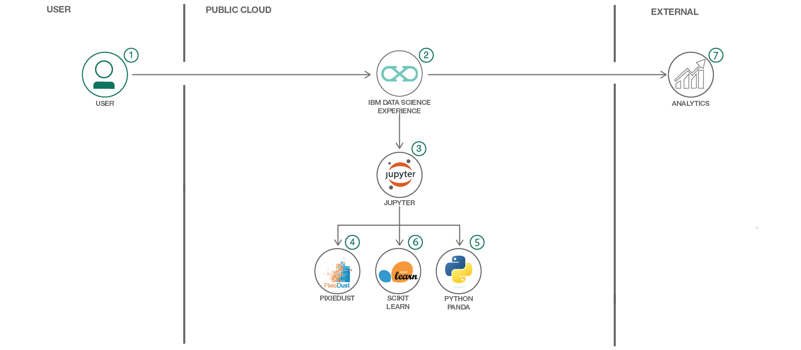

## Use Machine Learning to Predict U.S. Opioid Prescribers with Watson Studio and Scikit Learn

> Data Science Experience is now Watson Studio. Although some images in this code pattern may show the service as Data Science Experience, the steps and processes will still work.

This Code Pattern will focus on and guide you through how to use `scikit learn` and `python` in Watson Studio to predict opioid prescribers based off of a [2014 kaggle dataset](https://www.kaggle.com/apryor6/us-opiate-prescriptions/data).

Opioid prescriptions and overdoses are becoming an increasingly overwhelming problem for the United States, even causing a declared state of emergency in recent months. Though we, as data scientists, may not be able to single handedly fix this problem, we can dive into the data and figure out what exactly is going on and what may happen in the future given current circumstances.

This Code Pattern aims to do just that: it dives into a kaggle dataset which looks at opioid overdose deaths by state as well as different, unique physicians, their credentials, specialties, whether or not they've prescribed opioids in 2014 as well as the specific names of the prescriptions they have prescribed. Follow along to see how to explore the data in a Watson Studio notebook, visualize a few initial findings in a variety of ways, including geographically, using Pixie Dust. Pixie Dust is a great library to use when you need to explore your data visually very quickly. It literally only needs one line of code! Once that initial exploration is complete, this Code Pattern uses the machine learning library, scikit learn, to train several models and figure out which have the most accurate predictions of opioid prescriptions. Scikit learn, if you're unfamiliar, is a machine learning library, which is commonly used by data scientists due to its ease of use. Specifically, by using the library you're able to easily access a number of machine learning classifiers which you can implement with relatively minimal lines of code. Even more, scikit learn allows you to visualize your output, showcasing your findings. Because of this, the library is often used in machine learning classes to teach what different classifiers do- much like the comparative output this Code Pattern highlights! Ready to dive in?



## Flow

1. Log into IBM's Watson Studio service.
2. Upload the data as a data asset into Watson Studio.
3. Start a notebook in Watson Studio and input the data asset previously created.
4. Explore the data with pandas
5. Create data visualizations with Pixie Dust.
6. Train machine learning models with scikit learn.
7. Evaluate their prediction performance.

## Included components

* [IBM Watson Studio](https://dataplatform.ibm.com): Analyze data using RStudio, Jupyter, and Python in a configured, collaborative environment that includes IBM value-adds, such as managed Spark.
* [Jupyter Notebook](http://jupyter.org/): An open source web application that allows you to create and share documents that contain live code, equations, visualizations, and explanatory text.
* [PixieDust](https://github.com/ibm-watson-data-lab/pixiedust): Provides a Python helper library for IPython Notebook.

## Featured technologies

* [Data Science](https://medium.com/ibm-data-science-experience/): Systems and scientific methods to analyze structured and unstructured data in order to extract knowledge and insights.
* [Python](https://www.python.org/): Python is a programming language that lets you work more quickly and integrate your systems more effectively.
* [pandas](http://pandas.pydata.org/): A Python library providing high-performance, easy-to-use data structures.

# Steps

This Code Pattern consists of two activities:

* [Run a Jupyter notebook in the IBM Watson Studio](#run-using-a-jupyter-notebook-in-the-ibm-watson-studio).
* [Analyze and Predict the data](#analyze-and-predict-the-data).

## Run using a Jupyter notebook in the IBM Watson Studio

1. [Sign up for the Watson Studio](#1-sign-up-for-the-watson-studio)
2. [Create a new Watson Studio project](#2-create-a-new-watson-studio-project)
3. [Create the notebook](#3-create-the-notebook)
4. [Upload data](#4-upload-data)
5. [Run the notebook](#5-run-the-notebook)
6. [Save and Share](#6-save-and-share)

### 1. Sign up for the Watson Studio

Log in or sign up for IBM's [Watson Studio](https://dataplatform.ibm.com).

> Note: if you would prefer to skip the remaining Watson Studio set-up steps and just follow along by viewing the completed Notebook, simply:
> * View the completed [notebook](https://dataplatform.ibm.com/analytics/notebooks/c32975c1-3994-42cc-8e2d-3f579ceebf63/view?access_token=cdb14a077ed4746b09b1dbaa05aee70133589f001dbb7582ba4e7fcfdd73a905) and its outputs, as is.
> * While viewing the notebook, you can optionally download it to store for future use.
> * When complete, continue this code pattern by jumping ahead to the [Analyze the data in Watson Analytics](#analyze-the-data-in-watson-analytics) section.

### 2. Create a new Watson Studio project

* Select the `New Project` option from the Watson Studio landing page and choose the `Data Science` option.


* To create a project in Watson Studio, give the project a name and either create a new `Cloud Object Storage` service or select an existing one from your IBM Cloud account.


* Upon a successful project creation, you are taken to a dashboard view of your project. Take note of the `Assets` and `Settings` tabs, we'll be using them to associate our project with any external assets (datasets and notebooks) and any IBM cloud services.


### 3. Create the Notebook

* From the project dashboard view, click the `Assets` tab, click the `+ New notebook` button.


* Give your notebook a name and select your desired runtime, in this case we'll be using the associated Spark runtime.


* Now select the `From URL` tab to specify the URL to the notebook in this repository.


* Enter this URL:

```
https://github.com/IBM/predict-opioid-prescribers/blob/master/notebooks/opioid-prescription-prediction.ipynb
```

* Click the `Create` button.

### 4. Upload data

* Return to the project dashboard view and select the `Assets` tab.
* This project has 3 datasets. Upload all three as data assets in your project. Do this by loading each dataset into the pop up section on the right hand side. Please see a screenshot of what it should look like below.   
* Once complete, go into your notebook in the edit mode (click on the pencil icon next to your notebook on the dashboard). 
* Click on the ``1001`` data icon in the top right. The data files should show up. 
* Click on each and select ``Insert Pandas Data Frame``. Once you do that, a whole bunch of code will show up in your first cell. 
* Make sure your ``opioids.csv`` is saved as ``df_data_1``, ``overdoses.csv`` is saved as ``df_data_2`` and ``prescriber_info.csv`` is saved as ``df_data_3`` so that it is consistent with the original notebook. You may have to edit this because when your data is loaded into the notebook, it may be defined as a continuation of data frames, based on where I left off. This means your data may show up with ``opioids.csv`` as ``df_data_4``, ``overdoses.csv`` as ``df_data_5`` and so on. Either adjust the data frame names to be in sync with mine (remove where I loaded data and rename your data frames or input your loading information into the original code) or edit the following code below accordingly. Do this to make sure the code will run!

 

### 5. Run the notebook

When a notebook is executed, what is actually happening is that each code cell in
the notebook is executed, in order, from top to bottom.

Each code cell is selectable and is preceded by a tag in the left margin. The tag
format is `In [x]:`. Depending on the state of the notebook, the `x` can be:

* A blank, this indicates that the cell has never been executed.
* A number, this number represents the relative order this code step was executed.
* A `*`, this indicates that the cell is currently executing.

There are several ways to execute the code cells in your notebook:

* One cell at a time.
  * Select the cell, and then press the `Play` button in the toolbar.
* Batch mode, in sequential order.
  * From the `Cell` menu bar, there are several options available. For example, you
    can `Run All` cells in your notebook, or you can `Run All Below`, that will
    start executing from the first cell under the currently selected cell, and then
    continue executing all cells that follow.
* At a scheduled time.
  * Press the `Schedule` button located in the top right section of your notebook
    panel. Here you can schedule your notebook to be executed once at some future
    time, or repeatedly at your specified interval.
    
### 6. Save and Share

#### How to save your work:

Under the `File` menu, there are several ways to save your notebook:

* `Save` will simply save the current state of your notebook, without any version
  information.
* `Save Version` will save your current state of your notebook with a version tag
  that contains a date and time stamp. Up to 10 versions of your notebook can be
  saved, each one retrievable by selecting the `Revert To Version` menu item.

#### How to share your work:

You can share your notebook by selecting the ``Share`` button located in the top
right section of your notebook panel. The end result of this action will be a URL
link that will display a “read-only” version of your notebook. You have several
options to specify exactly what you want shared from your notebook:

* `Only text and output`: will remove all code cells from the notebook view.
* `All content excluding sensitive code cells`:  will remove any code cells
  that contain a *sensitive* tag. For example, `# @hidden_cell` is used to protect
  your dashDB credentials from being shared.
* `All content, including code`: displays the notebook as is.
* A variety of `download as` options are also available in the menu.

## Analyze and Predict the data
 
1. Explore the different datasets using python, pandas and Pixie Dust. Once again, feel free to [follow along in Watson Studio](https://dataplatform.ibm.com/analytics/notebooks/c32975c1-3994-42cc-8e2d-3f579ceebf63/view?access_token=cdb14a077ed4746b09b1dbaa05aee70133589f001dbb7582ba4e7fcfdd73a905).

To get familiar with your data, explore it with visualizations and by looking at subsets of the data. For example, we see that though California has the highest overdoses, when we correct for population we see that West Virginia actually has the highest rate of overdoses per capita.

2. Clean the data using python.

Every dataset has its imperfections. Let's clean ours up by making the States consistent and changing our columns to allow us to use them as integers.

3. Run several models to predict opioid prescribers using scikit learn.

You can check out the output in the notebook or in the image below. In this step we run several machine learning models in order to evaluate which is the most effective at predicting opioid prescribers. Though it is beyond the scope of this pattern, by predicting these opioid prescribers you are laying the framework to predict the likelihood that a certain type of doctor prescribes opioids. Additionally, if we had more years of data (beyond 2014) we could also predict future rates of overdoses. For now, we'll just take a look at the models.

4. Evaluate the models.

For the code, see the notebook found locally under [notebooks](notebooks), or view the notebook [here](https://dataplatform.ibm.com/analytics/notebooks/c32975c1-3994-42cc-8e2d-3f579ceebf63/view?access_token=cdb14a077ed4746b09b1dbaa05aee70133589f001dbb7582ba4e7fcfdd73a905)!

## Sample output

After running various classifiers, we find that Random Forest, Gradient Boosting and our Ensemble models had the best performance on predicting opioid prescribers.


Awesome job following along! Now go try and take this further or apply it to a different use case!

## Links

 - Watson Studio: https://datascience.ibm.com/docs/content/analyze-data/creating-notebooks.html.
 - Pandas: http://pandas.pydata.org/
 - Pixie Dust: https://ibm-watson-data-lab.github.io/pixiedust/displayapi.html#introduction
 - Data: https://www.kaggle.com/apryor6/us-opiate-prescriptions/data
 - Scikit Learn: http://scikit-learn.org/stable/

# Learn more

* **Data Analytics Code Patterns**: Enjoyed this Code Pattern? Check out our other [Data Analytics Code Patterns](https://developer.ibm.com/code/technologies/data-science/)
* **AI and Data Code Pattern Playlist**: Bookmark our [playlist](https://www.youtube.com/playlist?list=PLzUbsvIyrNfknNewObx5N7uGZ5FKH0Fde) with all of our Code Pattern videos
* **Watson Studio**: Master the art of data science with IBM's [Watson Studio](https://dataplatform.ibm.com/)
* **Spark on IBM Cloud**: Need a Spark cluster? Create up to 30 Spark executors on IBM Cloud with our [Spark service](https://console.bluemix.net/catalog/services/apache-spark)

# License
[Apache 2.0](LICENSE)
